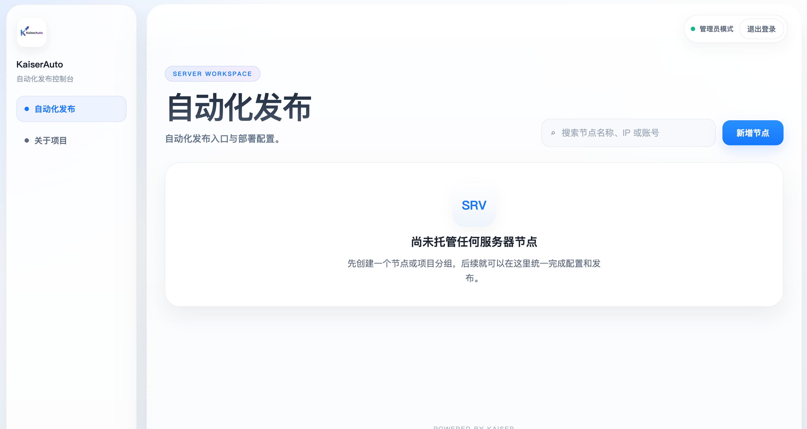
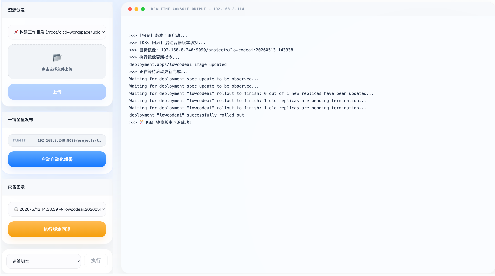
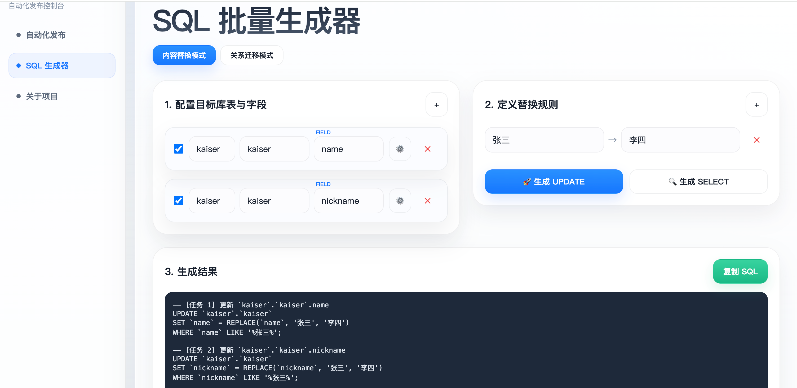
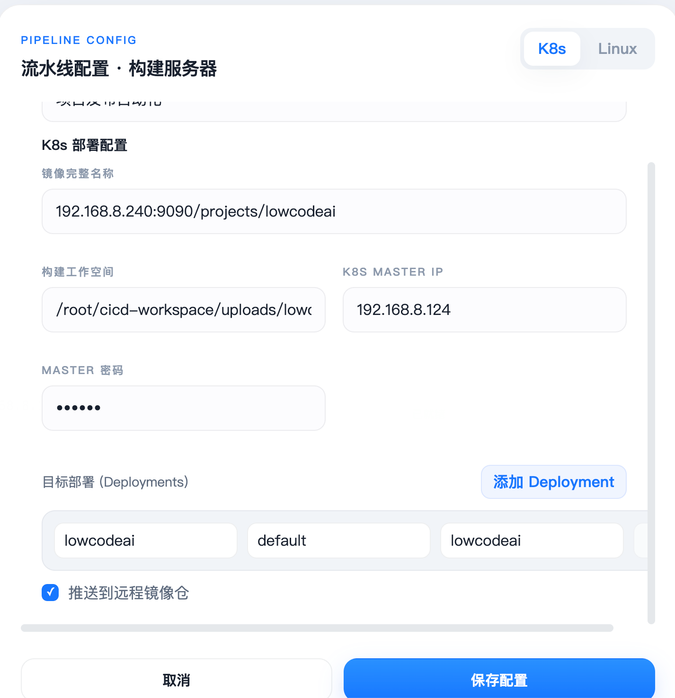
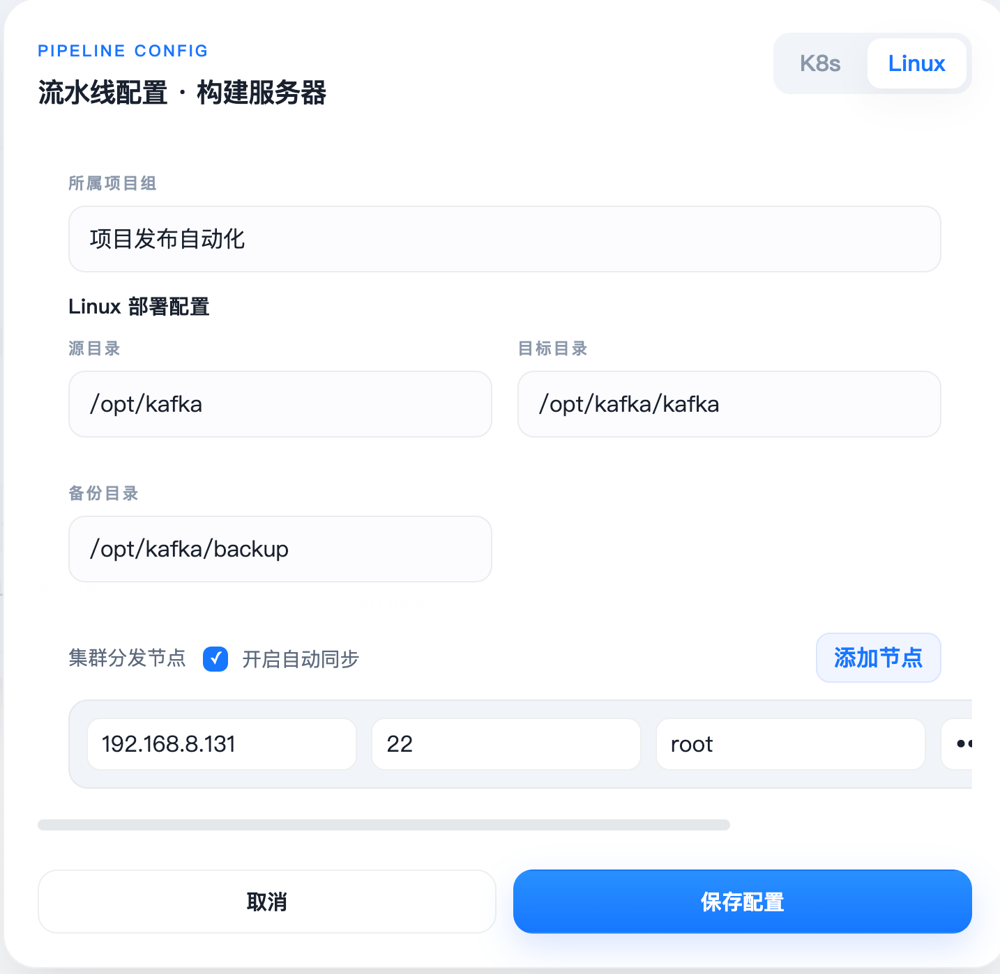

# KaiserAuto - 高级自动化发布与集群管理控制台

KaiserAuto 是一款专为中小型团队设计的轻量级、高性能 CI/CD 自动化控制台。它通过无代理架构与现代化的 Web 交互，将复杂的流水线操作简化为直观的驾驶舱体验。







---

## 🚀 核心价值 (Core Value)
- **零配置负担**：基于原生 SSH 协议，无需在生产服务器安装任何 Agent 插件。
- **发布即监控**：流式日志技术实时反馈每一步指令的成功与失败。
- **资产透明化**：以“项目”为维度聚合服务器资产，实现多环境（开发/测试/生产）的一屏管控。

---

## ✨ 核心特性 (Key Features)

### 1. 智能双模发布体系 (Dual-Mode Pipeline)
*   **Linux 传统模式**：集群同步 (Sync Nodes)、目录自愈、原子化备份。
*   **Kubernetes 容器模式**：镜像全自动生命周期管理、多目标滚动更新、集群状态追踪。

### 2. 增强型实时控制台 (Smart Live-Terminal)
*   **流式日志传输**：基于 SSE 技术，大并发下依然保持界面丝滑。
*   **错误自动捕获**：智能识别 Shell 退出码，即时中断流程保护生产环境。

*   **SQL 批量生成引擎**：支持 `REPLACE` 与 `MIGRATE` 双模式，轻松处理万级行政区划调整。
*   **可视化目录扫描器**、**自定义运维脚本**、**跨环境配置克隆**。

---

### 4. SQL 批量生成引擎 (SQL Batch Generator)
专门为复杂数据库运维任务（如行政区划调整、层级重构）设计的生成工具：
*   **内容替换模式 (REPLACE)**：批量 `Old -> New` 字符串替换，支持 `CASE WHEN` 逻辑优化。
*   **关系迁移模式 (MIGRATE)**：支持通过名称映射自动查找目标 ID，并生成跨库/跨表的层级关联 SQL。
*   **多维过滤体系**：支持主条件 + 无限制附加 `LIKE` 过滤条件，确保精准定位目标行。
*   **安全验证机制**：一键生成“校验查询”语句，在执行 `UPDATE` 前先行验证数据范围。

---

## 🛠 技术规格 (Technical Stack)
- **核心引擎**: Next.js 15 + React 19
- **视觉层**: Vanilla CSS 3 (支持毛玻璃/渐变渲染)
- **通信协议**: SSH2, SFTP, SSE (Server-Sent Events)
- **开发语言**: TypeScript

---

## 📦 快速部署 (Quick Start)

### 方式一：本地运行
```bash
# 安装依赖
npm install

# 生产环境构建
npm run build

# 启动服务
npm run dev


访问地址:http://localhost:3000
账号:admin 密码:admin123
```

### 方式二：Docker 部署
```bash
# 构建镜像
docker build -t kaiser-auto .

# 启动容器
docker run -d -p 3000:3000 --name kaiser-auto kaiser-auto
```

---

## 🔒 开源声明与免责声明

### 开源协议
本项目遵循 [MIT License](LICENSE) 协议开源。

### 免责声明
**请在正式使用前阅读以下条款：**
1. 本项目仅供学习、研究及开发测试使用。
2. 使用本项目进行自动化部署或服务器操作存在风险，**作者不对因使用本项目导致的任何数据丢失、服务器损坏或法律纠纷承担任何责任**。
3. 请在生产环境使用前，务必在测试环境进行充分验证。

---

## ☕️ 投喂作者 (Support)
如果您觉得这个项目对您有帮助，可以请作者喝杯咖啡 ☕️。您的支持是我持续维护和优化的动力！

| 支付宝 | 微信 |
| :---: | :---: |
|  |  |

---

## 📬 联系与贡献
- **Issue**: 欢迎提交 Bug 反馈或 Feature Request。
- **Pull Request**: 期待您的代码贡献，共同完善项目。

---
Powered by Kaiser